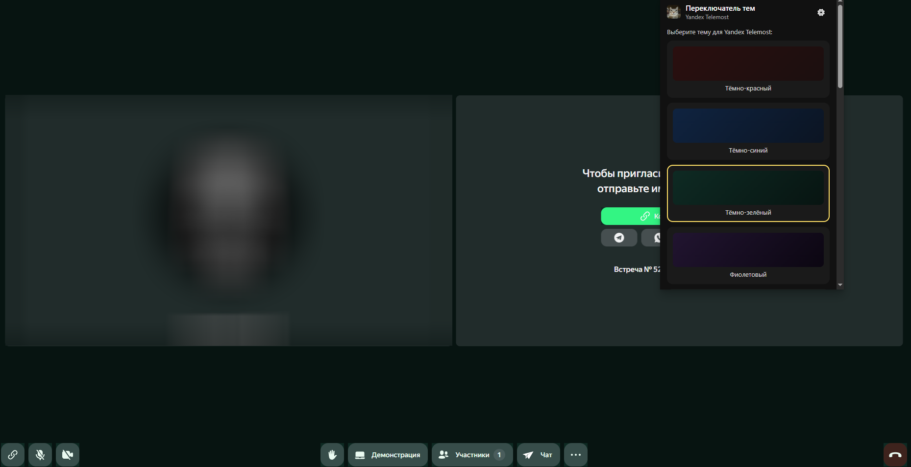

# 🎨 Yandex Telemost Theme Switcher

Расширение для смены тем в **Yandex Telemost**  
Работает в **Яндекс.Браузере**, **Google Chrome** и в других браузерах!

---

## 🖼 Превью

---
## 📥 Релизы
Все версии расширения, история изменений и готовые сборки доступны на странице релизов:

👉 **[СКАЧАТЬ ПОСЛЕДНЮЮ ВЕРСИЮ](https://github.com/Niklaser-Sosal/Yandex-Telemost-Theme-Switcher/releases/download/RELEASES/yandex-telemost-theme-switcher.zip)**

---

## 🚀 Возможности

- Переключение тем без перезагрузки страницы
- Минималистичный интерфейс
- Локальная работа (без сторонних серверов)
- Совместимо с Yandex Telemost

---

## 📦 Установка (локально)

1. Скачайте или распакуйте папку `yandex-telemost-theme-switcher`
2. Откройте браузер  
   **Меню → Дополнения → Режим разработчика**
3. Нажмите **Загрузить распакованное расширение**
4. Выберите папку проекта
5. Перейдите на  
   👉 https://telemost.yandex.ru  
   и нажмите на иконку расширения

---

## ⚠️ Примечания

- Работает только на `telemost.yandex.ru`
- Возможны изменения при обновлениях Telemost.
- Не является официальным расширением Яндекса!
- Могут присутсвовать баги и недочёты.

---

